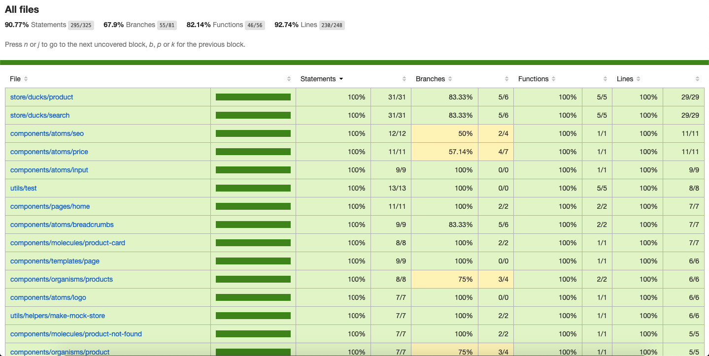
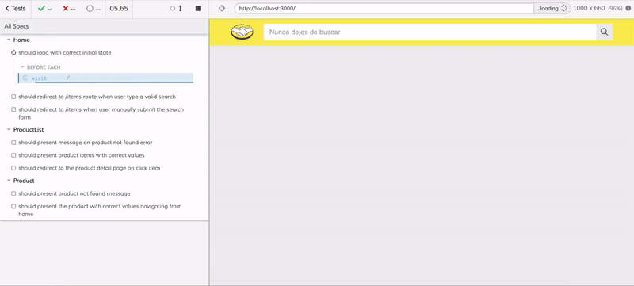

# MELI Product Finder

[](https://travis-ci.org/alan-nascimento/meli-product-finder)
[](https://coveralls.io/github/alan-nascimento/meli-product-finder?branch=master)
[](https://opensource.org/licenses/)

## Description

> Practical frontend test of Mercado Livre.
> The project consists of performing a search in the search box, listing up to 4 products found in the search and enabling the visualization of the product detail.
> It is possible to access the application through this [link](https://meli-product-finder.vercel.app). The BFF for this application is available at this [link](https://github.com/alan-nascimento/meli-product-finder-api).

## Prerequisites

```
$ git >= v2.x
$ npm >= v6.x
$ nodejs >= v10.x
```

## Installation and Getting Started

1. Clone this repository

```
$ git clone https://github.com/alan-nascimento/meli-product-finder.git
```

2. Install dependencies

```
$ npm install
```

3. NOTE: The env is setted by `.env.development`. You can also create an `.env.local` file to set the environment variables.

4. Start the local server

```
$ npm run dev
```

## Running unit testing

1. Open a new terminal execute:

```
$ npm run test
```

3. Run the following command to collect coverage report:

```
$ npm run test:ci
```



## Running end-to-end testing

1. Open a new terminal and ensure you have the project running:

```
$ npm run dev
```

2. Start the test server:

```
$ npm run test:e2e
```

3. After executing the command, a Cypress dashboard of the steps for each test will open.

4. Click on run all tests to see the execution and the report:



5. To see report on terminal, execute the following command:

```
$ npm run test:e2e:run
```

## Running Linter

1. Run the following command at the terminal:

```
$ npm run lint
```

## Production Build

1. Run the following command:

```
$ npm run build
```

2. The build result will be avaiable at the `next` folder.

## Libraries and Tools

- [TypeScript](https://www.typescriptlang.org/)
- [React](https://reactjs.org/)
- [NextJS](https://nextjs.org/)
- [Redux](https://redux.js.org/)
- [Redux Thunk](https://github.com/reduxjs/redux-thunk)
- [Axios](https://github.com/axios/axios)
- [Material UI](http://material-ui.com/)
- [Styled Components](https://styled-components.com/)
- [Jest](https://jestjs.io/)
- [React Testing Library](https://testing-library.com/docs/react-testing-library/intro)
- [Cypress](https://cypress.io)
- [Git](https://git-scm.com/)
- [NPM](npmjs.com/)
- [Travis CI](https://travis-ci.org/)
- [Coveralls](https://coveralls.io)
- [Husky](https://github.com/typicode/husky)
- [Lint Staged](https://github.com/okonet/lint-staged)
- [ESLint](https://eslint.org/)
- [Prettier](https://prettier.io/)

## Author & Version Control

Developed by **Alan Nascimento - [Github](https://github.com/alan-nascimento)** - **_Published in October of 2020_**.
